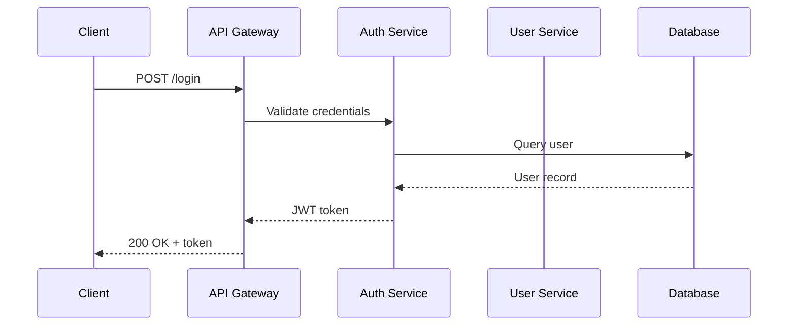

# 各類圖表最佳實踐

## 1. 系統架構圖 (Architecture Diagram)

### 佈局原則

```
┌──────────────────────────────────────────────┐
│  使用者 / 外部 (綠色)                          │
├──────────────────────────────────────────────┤
│  網路 / Gateway 層 (藍色)                      │
├──────────────────────────────────────────────┤
│  服務 / 應用層 (橙色)                          │
├──────────────────────────────────────────────┤
│  資料 / 儲存層 (紫色)                          │
├──────────────────────────────────────────────┤
│  基礎設施 / 監控 (灰色)                        │
└──────────────────────────────────────────────┘
```

- 由上而下：使用者 → Gateway → 服務 → 資料庫
- 每層用 swimlane 容器包裝
- 層內節點水平排列，間距 ≥ 200px
- 連線主要垂直走向，同層連線水平走向
- 雙向箭頭表示同步通訊，單向虛線表示非同步

### 連線防重疊策略

架構圖最容易出現連線重疊，因為多個服務可能連向同一個資料庫：

1. **資料庫放中間**：多個服務連向同一 DB 時，DB 放在服務們的正下方中央
2. **分散 entryX**：多條連線進入同一節點時，分散入口 `entryX=0.25/0.5/0.75`
3. **分散 exitX**：多條連線從同一節點出發時，分散出口
4. **必要時用 waypoints**：兩條連線路徑完全重疊時，為其中一條加 waypoint 繞道

---

## 2. 流程圖 (Flowchart)

### 佈局原則

- 主流程由上而下或由左而右
- 決策點（菱形）的 Yes/No 分支方向一致：Yes 向下，No 向右（或反之）
- 迴圈箭頭從底部回到頂部，走左側或右側繞回
- 起始/結束用圓角矩形（`rounded=1;arcSize=50;`）
- 處理步驟用矩形
- 決策用菱形

### 配色

| 元素 | 填色 | 邊框色 |
|------|------|--------|
| 開始/結束 | `#E8F5E9` | `#43A047` |
| 處理步驟 | `#E3F2FD` | `#1E88E5` |
| 決策 | `#FFF3E0` | `#FB8C00` |
| 輸入/輸出 | `#F3E5F5` | `#8E24AA` |
| 子流程 | `#ECEFF1` | `#546E7A` |

### 連線規則

- 統一使用正交連線
- 決策分支標註 "Yes" / "No"
- 迴圈連線走外側，不穿越其他節點

---

## 3. 序列圖 (Sequence Diagram)

**建議使用 Mermaid 語法**，因為序列圖的佈局較固定：



若用 XML 手動繪製：
- 參與者水平排列，間距 ≥ 180px
- 生命線（虛線）垂直向下
- 訊息箭頭水平，按時間順序由上而下
- 同步用實線箭頭，非同步用虛線箭頭
- 回應用虛線 + 開放箭頭

---

## 4. ER 圖 (Entity Relationship Diagram)

### 佈局原則

- 核心實體放中央
- 相關實體環繞核心
- 使用 `entityRelationEdgeStyle` 連線樣式
- 標註關係類型（1:1, 1:N, N:M）

### 節點樣式

```xml
<!-- 表格形式的 Entity -->
<mxCell value="User" style="shape=table;startSize=30;container=1;collapsible=1;childLayout=tableLayout;fixedRows=1;rowLines=0;fontStyle=1;align=center;resizeLast=1;fillColor=#E3F2FD;strokeColor=#1E88E5;" vertex="1" parent="1">
  <mxGeometry x="100" y="100" width="200" height="120" as="geometry"/>
</mxCell>
```

### 關係標記

| 關係 | 來源箭頭 | 目標箭頭 |
|------|---------|---------|
| 1:1 | `ERone` | `ERone` |
| 1:N | `ERone` | `ERmany` |
| N:M | `ERmany` | `ERmany` |
| 0..1 | `ERzeroToOne` | — |
| 0..N | `ERzeroToMany` | — |
| 1..N | `ERoneToMany` | — |

```xml
<mxCell style="edgeStyle=entityRelationEdgeStyle;endArrow=ERmany;startArrow=ERone;strokeColor=#666;" edge="1" source="user" target="order" parent="1">
  <mxGeometry relative="1" as="geometry"/>
</mxCell>
```

---

## 5. 部署圖 (Deployment Diagram)

### 佈局原則

- 左側：外部使用者/流量入口
- 中央：應用服務集群
- 右側：資料儲存/外部服務
- 用虛線框表示 VPC/子網路/可用區
- 用圖標區分不同服務類型

### 配色（通用雲端）

| 區域 | 填色 | 邊框色 |
|------|------|--------|
| VPC / 網路邊界 | `#ECEFF1` | `#546E7A`（虛線） |
| 公開子網路 | `#E3F2FD` | `#1E88E5`（虛線） |
| 私有子網路 | `#FFF3E0` | `#FB8C00`（虛線） |
| 資料區 | `#F3E5F5` | `#8E24AA`（虛線） |

---

## 6. C4 模型圖

### Level 1: Context Diagram

- 系統放中央（大矩形）
- 使用者和外部系統環繞
- 連線標註交互方式

### Level 2: Container Diagram

- 系統邊界用虛線框
- 內部容器（Web App, API, DB）在框內
- 外部系統在框外

### Level 3: Component Diagram

- 容器邊界用虛線框
- 內部元件在框內
- 標註技術選型（如 "React SPA", "Go REST API"）

### C4 配色

| 元素 | 填色 | 邊框色 |
|------|------|--------|
| Person | `#08427B` (深藍填色白字) | — |
| System (本系統) | `#1168BD` (藍色填色白字) | — |
| System (外部) | `#999999` (灰色填色白字) | — |
| Container | `#438DD5` (淺藍填色白字) | — |
| Component | `#85BBF0` (更淺藍填色) | — |

---

## 7. 狀態機圖 (State Machine Diagram)

### 佈局

- 初始狀態（實心圓）在左上
- 最終狀態（圓環內實心圓）在右下
- 狀態由左向右、由上向下流動
- 循環回退走上方或左方

### 節點樣式

```xml
<!-- 初始狀態 -->
<mxCell style="ellipse;fillColor=#000000;strokeColor=none;" vertex="1" parent="1">
  <mxGeometry x="50" y="50" width="30" height="30" as="geometry"/>
</mxCell>

<!-- 一般狀態 -->
<mxCell style="rounded=1;whiteSpace=wrap;arcSize=20;fillColor=#E3F2FD;strokeColor=#1E88E5;" vertex="1" parent="1">
  <mxGeometry x="150" y="40" width="120" height="50" as="geometry"/>
</mxCell>

<!-- 最終狀態 -->
<mxCell style="ellipse;html=1;shape=doubleCircle;whiteSpace=wrap;fillColor=#000000;strokeColor=none;" vertex="1" parent="1">
  <mxGeometry x="500" y="300" width="30" height="30" as="geometry"/>
</mxCell>
```

---

## Mermaid 速查

適合用 `mcp__drawio__open_drawio_mermaid` 的場景：

```mermaid
%% 流程圖
graph TD
    A[Start] --> B{Decision}
    B -->|Yes| C[Process]
    B -->|No| D[End]
    C --> D

%% 序列圖
sequenceDiagram
    A->>B: Request
    B-->>A: Response

%% 類別圖
classDiagram
    class Animal {
        +String name
        +makeSound()
    }
    Animal <|-- Dog
    Animal <|-- Cat

%% 狀態圖
stateDiagram-v2
    [*] --> Idle
    Idle --> Processing : submit
    Processing --> Done : complete
    Done --> [*]
```

**注意**：Mermaid 圖表的佈局由引擎自動計算，無法精確控制節點位置。需要精確控制時，改用 XML。
